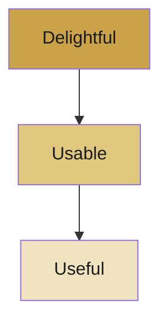
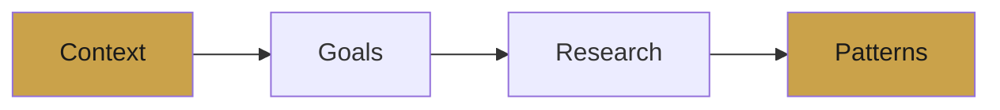
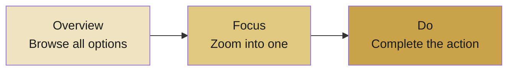
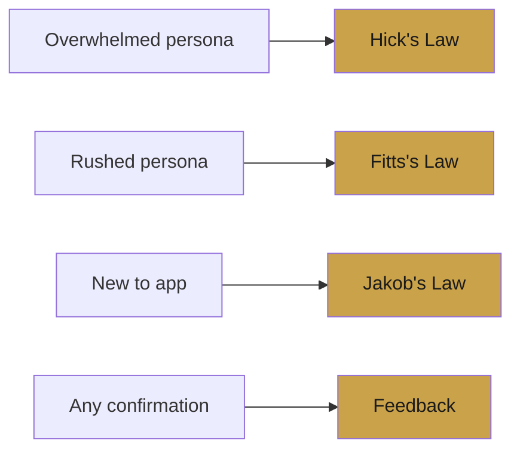

# UIX544 — Exam Cheat Sheet

> Read this 3 times. You'll ace it.

---

## UI vs UX

| | UI | UX |
|---|---|---|
| What | How it **looks** | How it **feels** |
| Focus | Buttons, colors, layout | Flow, emotion, ease |
| Question | Is it clear? | Was it effortless? |

> UI is the plate. UX is the meal.

---

## UX Pyramid

Build in order: **Useful first → then Usable → then Delightful**

---

## Understanding Users

**Ask WHY — the Goal Iceberg:**

| Visible | Hidden |
|---------|--------|
| "I want to order food" | "I don't want to be late" |
| Transactional goal | Real driver |

> The persona quote = always the hidden driver.

---

## Persona — Brain / Heart / Hands

| | What it captures |
|---|---|
| Brain | Goals + mental models |
| Heart | Frustrations + motivations |
| Hands | Actions + tasks |

**Skill Levels:**

| Level | Needs |
|-------|-------|
| Occasional | Lots of guidance |
| Intermediate | Balance of help + speed |
| Expert | Fast, no hand-holding |

> Judge skill level for **this app**, not the user in general.

---

## Task Flow

| Rule | |
|------|-|
| 5–8 steps only | No more, no less |
| No yes/no branches | That's a usage flow |
| No login or instructions | Not part of the task |
| Must match the persona | Design for them, not yourself |

**Task Flow vs Usage Flow:**

| Task Flow | Usage Flow |
|-----------|-----------|
| Main path only | Every possible path |
| 5–8 steps | Long and branching |
| No logic | Full of yes/no |

---

## Screen Types

| Type | Purpose | Key UI |
|------|---------|--------|
| Overview | See all options | Cards, list, grid |
| Focus | Configure one item | Selectors, toggles |
| Do | Final action | Confirm button, summary |

---

## Navigation

| Pattern | Use On | Answers |
|---------|--------|---------|
| Tab Bar (bottom) | Mobile | Where can I go? |
| Top / Left Nav | Desktop | Where can I go? |
| Progress Indicator | Multi-step | Where am I? |
| Back Button | Every screen | How do I get back? |

> Mobile = Tab Bar at the bottom. Always.

---

## UX Laws

| Law | One Line | Use When |
|-----|----------|----------|
| **Hick's Law** | Fewer choices = faster decisions | Persona is overwhelmed |
| **Fitts's Law** | Big + close = easy to tap | Persona is in a hurry |
| **Jakob's Law** | Familiar patterns = faster learning | Persona is new to app |
| **Feedback** | Every action needs a response | Always — especially on confirm |

---

## The Golden Rules

- Design for the **user**, not yourself
- **Ask WHY** before designing anything
- **Less is more** — reduce steps, reduce choices
- Always **give feedback** — never leave users guessing
- **Consistency** — same patterns, same behavior everywhere
- Every decision needs a **reason tied to the persona**

---

> ✍️ *Writed by Nikan Eidi*