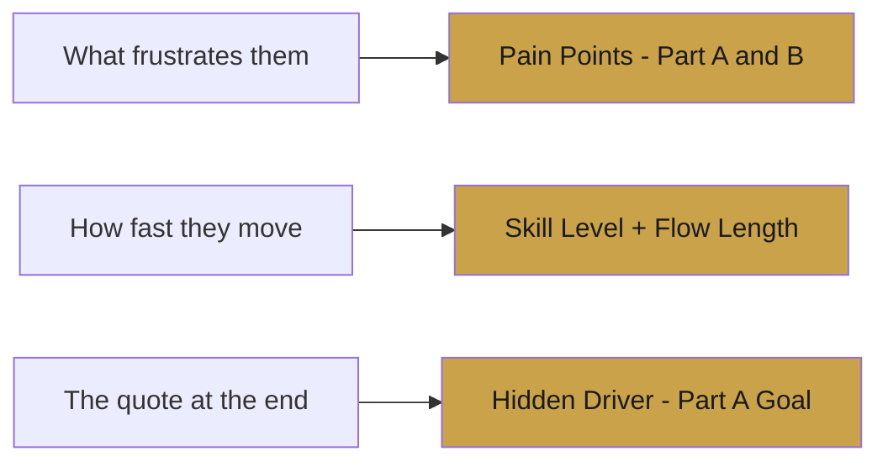
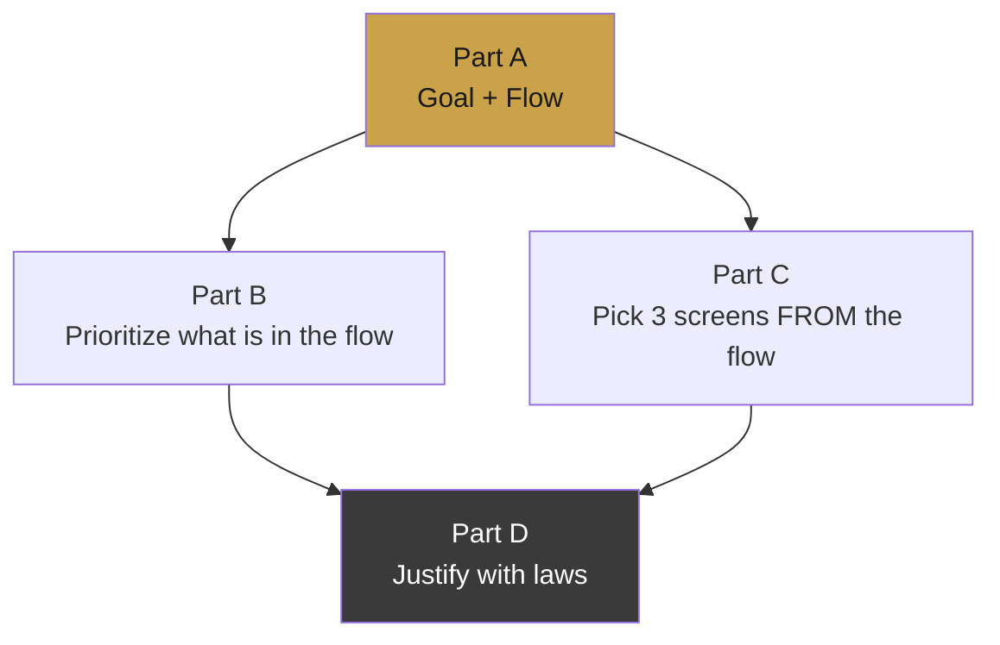
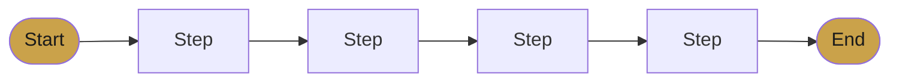
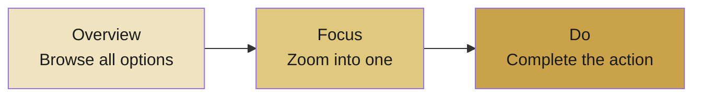

# UIX544 — Exam Cheat Sheet

> One page. Everything that matters. Read this before you walk in.

---

## The One Rule

> **Every design decision must connect back to the persona.**
> No persona connection = no marks.

---

## How to Read a Persona in 30 Seconds

---

## The 4-Part Answer Map

> **Part A feeds everything. Get the task flow right first.**

---

## Part A — 5 Sentences

| # | Sentence | Rule |
|---|----------|------|
| 1 | Goal | task + hidden driver |
| 2 | Pain points | 2–3 from persona, never repeat goal |
| 3 | Task flow | Start → ... → End, 5–8 steps, no yes/no |
| 4 | Feedback | when + why, always after confirm |
| 5 | Friction | one problem + one fix |

**Task Flow:** + steps only — no login, no instructions, no yes/no branches

---

## Part B — 4 Sentences

| # | Sentence |
|---|----------|
| 1 | Most important info the user needs to see |
| 2 | Actions that must be large and easy to reach |
| 3 | Why this fits the persona specifically |
| 4 | One UI decision that cuts effort or confusion |

---

## Part C — Screen Types

| Type | Key UI Elements |
|------|----------------|
| Overview | Cards, list, grid, filters |
| Focus | Selectors, toggles, checkboxes |
| Do | Confirm button, order summary, feedback |

> Pick all 3 screens directly from your Part A task flow.

---

## Part D — 4 Sentences

| # | Sentence |
|---|----------|
| 1 | One nav decision + why it helps |
| 2 | Principle 1 + specific UI decision |
| 3 | Principle 2 + specific UI decision |
| 4 | Together they support the persona because... |

---

## UX Laws

| Law | Rule | Use When |
|-----|------|----------|
| **Hick's Law** | Fewer choices = faster decisions | Persona feels overwhelmed |
| **Fitts's Law** | Big + close = easy to tap | Persona is in a hurry |
| **Jakob's Law** | Familiar = faster to learn | Persona is new to the app |
| **Feedback** | Every action needs a response | Always — especially on confirm |

---

## Navigation Patterns

| Pattern | Platform |
|---------|----------|
| Tab Bar — bottom | Mobile |
| Top or Left Nav | Desktop |
| Progress Indicator | Multi-step flows |
| Back Button | Every screen |

---

## Pre-Submit Checklist

- [ ] **A** — goal + pain points + 5–8 step flow + feedback + friction fix
- [ ] **B** — key info + easy actions + persona fit + one design decision
- [ ] **C** — 3 screens with type + reason + UI element + user progress
- [ ] **D** — 1 nav decision + 2 named laws + UI decisions + persona tie-in

---

> ✍️ *Writed by Nikan Eidi*