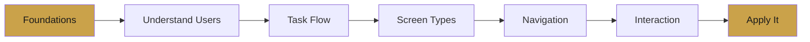

# 🎨 UIX-by-Nik

### Introduction to User Interface & User Experience Design

Clean, structured notes covering the fundamentals of UI/UX design — from understanding users to building interactions that feel effortless.

---

## 📚 What's Inside

A full walkthrough of core UI/UX concepts, organized lecture by lecture. Each note is written to be **fast to read, easy to remember, and exam-ready**.

---

## 🗂️ Lecture Index

| # | Lecture | What You'll Learn |
|---|---------|-------------------|
| 1 | [Foundations of UI/UX](lectures/lecture-1.md) | UI vs UX, design goals, core principles, designing for humans |
| 2 | [Understanding Users](lectures/lecture-2.md) | User research, personas, hidden goals, skill levels |
| 3 | [Task Flow](lectures/lecture-3.md) | Task flow vs usage flow, mapping the user journey |
| 4 | [Screen Types](lectures/lecture-4.md) | Overview, Focus, and Do screens |
| 5 | [Navigation](lectures/lecture-5.md) | Wayfinding, menus, progress, helping users stay oriented |
| 6 | [Interaction Design & UX Laws](lectures/lecture-6.md) | Hick's, Fitts's, Jakob's Law, feedback, consistency |
| 7 | [Putting It Together](lectures/lecture-7.md) | Persona + scenario → full design answer |

---

## 🎯 Core Ideas at a Glance

- **Design for the user, not yourself** — every decision needs a reason.
- **Solve the right problem first**, then solve it right.
- **Less is more** — reduce choices, reduce friction.
- **Always give feedback** — never leave the user guessing.
- **Stay consistent** — familiar patterns are faster to learn.

---

## 🚀 How to Use These Notes

1. Read top to bottom — each lecture builds on the last.
2. Use the Mermaid diagrams to visualize the flow.
3. Practice applying every concept to a real persona + scenario.

---

---
> ✍️ *Writed by Nikan Eidi*

