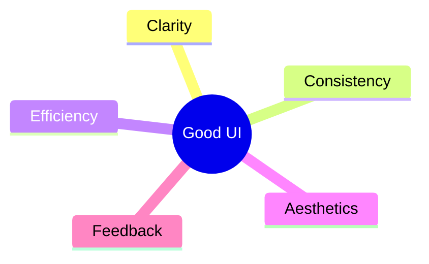
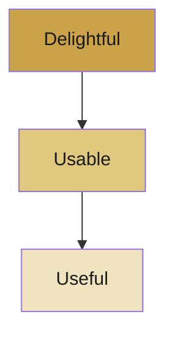

# 📘 Lecture 1 — Foundations of UI/UX

> The starting point: what UI and UX actually mean, and what makes a design *good*.

---

## 🧩 UI vs UX

They sound similar but solve different problems.

| | **UI** (User Interface) | **UX** (User Experience) |
|---|---|---|
| **Focus** | How it *looks* | How it *feels* |
| **Deals with** | Buttons, colors, layout, typography | Flow, emotion, ease, satisfaction |
| **Question** | "Is it clear and beautiful?" | "Was it effortless and pleasant?" |

> **Simple way to remember:** UI is the *plate*, UX is the *meal*.

---

## 🎯 Goals of UI Design

Five things a good interface should always achieve:

- **Clarity** — the user instantly understands what to do.
- **Consistency** — same patterns behave the same way everywhere.
- **Efficiency** — fewer steps, less effort.
- **Aesthetics** — visually pleasant and trustworthy.
- **Feedback** — the system responds to every action.

---

## 🏛️ Key UI Principles

- **Hierarchy** — important things look important.
- **Affordances** — elements hint at how to use them (a button looks tappable).
- **Consistency** — predictable behavior builds confidence.
- **Responsiveness** — adapts to screens and reacts fast.
- **Accessibility** — usable by *everyone*, including people with disabilities.

---

## 💡 Why UX Matters

Good UX means the product is **useful, usable, and enjoyable**. Bad UX frustrates users — and frustrated users leave.

### The UX Pyramid (Maslow-style)

A product must first be **useful**, then **usable**, and finally **delightful** — in that order.

---

## 🔑 Key Components of UX

| Component | What It Means |
|-----------|---------------|
| User Research | Learning what users actually need |
| Information Architecture | Organizing content logically |
| Interaction Design (IxD) | Designing how users act and the system reacts |
| Wireframing | Sketching layout before visuals |
| Usability | Making it easy to use |
| Accessibility | Making it usable for all |

---

## 🫂 Designing for Humans

Users are **emotional people, not robots**. Design with personality and care:

- **Tone:** professional + friendly + encouraging.
- **Forgiveness:** prevent errors, make them easy to undo, confirm before catastrophic actions.
- **Trust:** be honest, predictable, and reliable.
- **Minimize effort:** never make users think more than they have to.

---

---
> ✍️ *Writed by Nikan Eidi*

