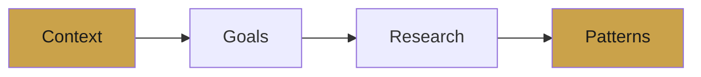
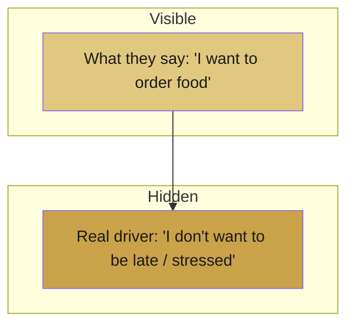
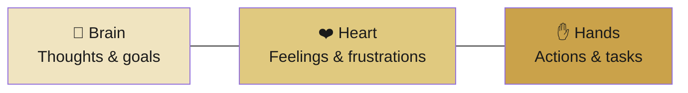

# 📗 Lecture 2 — Understanding Users

> You can't design for someone you don't understand. This lecture is about *truly knowing your user*.

---

## 🔍 The 4-Part Framework

Before designing anything, understand four things:

| Part | Question |
|------|----------|
| **Context** | Where is the user? What's their situation? |
| **Goals** | What are they trying to achieve? |
| **Research** | How do we discover this information? |
| **Patterns** | How do users typically behave? |

---

## 🧠 What to Understand About Users

- **Goals** — what they want to accomplish.
- **Language** — the words *they* use, not jargon.
- **Task Breakdown** — the steps to reach the goal.
- **Skill Levels** — beginner, intermediate, or expert.
- **Mental Models** — what they *expect* to happen.
- **Attitudes** — how they feel about the task.

---

## 💬 Interactions Are Conversations

Every interaction is a back-and-forth between two sides:

| Human Side | Software Side |
|------------|---------------|
| Takes an action | Responds with feedback |
| Has a goal | Guides toward it |
| Feels emotion | Should reduce friction |

---

## 🧊 Ask WHY — The Goal Iceberg

Users tell you *what* they want, but the real driver is hidden underneath.

- **Transactional Goal** — the task on the surface.
- **Hidden Driver** — the deeper *why*.

> Always ask **WHY** to design for what really matters.

---

## 🎚️ Designing for Skill Levels

| Level | Who | Needs |
|-------|-----|-------|
| **Occasional** | Uses it rarely | Lots of guidance |
| **Intermediate** | Fairly comfortable | Balance of help + speed |
| **Expert** | Power user | Speed, shortcuts, no hand-holding |

> Tip: judge skill level **for this specific app**, not the user in general.

---

## 🧪 Research Methods

### Qualitative vs Quantitative

| Qualitative | Quantitative |
|-------------|--------------|
| *Why* and *how* | *How many* and *how much* |
| Interviews, observation | Surveys, analytics |
| Rich detail | Hard numbers |

**Common methods:** Direct Observation · Case Studies · Surveys

> Design research ≠ Marketing research. Design asks *"how do we build it right?"* — marketing asks *"how do we sell it?"*

---

## 👤 Personas

A persona is a fictional but realistic user that represents your audience.

A good persona captures the **Brain** (what they think), **Heart** (what they feel), and **Hands** (what they do).

---

## 🎬 Storyboarding & Scenarios

A user scenario tells the story of how a persona reaches their goal:

> **Persona + Context + Goal + Steps + Outcome**

This keeps the design grounded in a real human story.

---

---
> ✍️ *Writed by Nikan Eidi*

