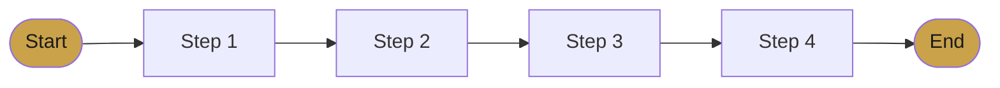
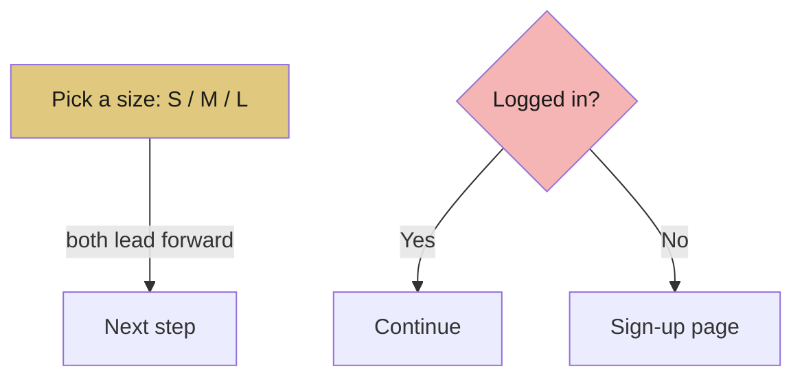

# 📙 Lecture 3 — Task Flow

> A task flow maps the *exact path* a user takes to complete one goal — clean, focused, and realistic.

---

## 🛤️ Task Flow vs Usage Flow

This is the most important distinction in this lecture.

| Task Flow ✅ | Usage Flow ❌ |
|-------------|--------------|
| One clear path to one goal | Every possible path including errors |
| No yes/no logic branches | Full of login, retry, cancel checks |
| 5–8 clean steps | Long and tangled |

> **Task flow ≠ usage flow.** Show the *main journey*, not every edge case.

---

## 📏 The Rules

- **5 to 8 steps**, from a clear **Start** to a clear **End**.
- **No decision diamonds** (yes/no logic). A task flow shows *steps*, not *logic*.
- It must be **realistic** — based on the persona, not on what's easy to draw.

---

## 🧭 Steps vs Decisions

A small "choose an option" is a **decision point** — that's fine.
A "yes/no, go to a different page" is **logic** — that belongs in a usage flow, *not* a task flow.

✅ Left = decision (keep it)
❌ Right = logic branch (avoid it in task flow)

---

## 🎯 Match the Flow to the Persona

The same task can have different flows depending on the user:

| User Type | Flow Shape |
|-----------|-----------|
| Occasional | More steps, one decision at a time |
| Expert | Fewer steps, options combined |

> Always ask: *"Does this step make sense for THIS persona?"*

---

## ✅ Quick Checklist

- [ ] Starts and ends clearly
- [ ] 5–8 steps
- [ ] No yes/no logic
- [ ] Matches the persona's real needs
- [ ] Every step has a purpose

---

---
> ✍️ *Writed by Nikan Eidi*

