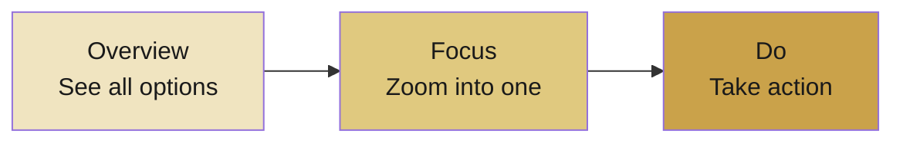
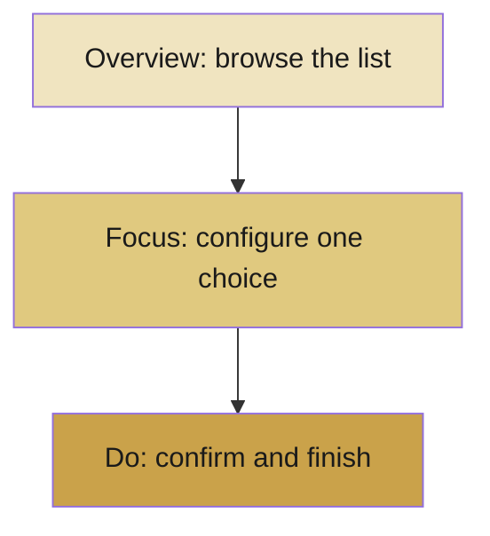

# 📕 Lecture 4 — Screen Types

> Every screen has *one job*. Knowing its type keeps your design focused and your user oriented.

---

## 🖼️ The Three Screen Types

| Type | Purpose | Typical Screen |
|------|---------|----------------|
| **Overview** | Show all options to choose from | List / grid of products |
| **Focus** | Zoom into one item or one decision | Detail or customization page |
| **Do** | Complete the final action | Confirm / checkout screen |

---

## 🔎 How to Tell Them Apart

- **Overview** → *"What are my options?"* → browsing.
- **Focus** → *"Tell me more about this one."* → deciding.
- **Do** → *"Make it happen."* → committing.

---

## 🗺️ How They Connect

Screens usually flow in this natural order:

---

## 🧱 What Belongs on Each Screen

| Screen Type | Key UI Elements |
|-------------|-----------------|
| Overview | Cards, lists, search, filters |
| Focus | Selectors, toggles, detail info |
| Do | Summary, confirm button, status message |

---

## 💡 Why This Matters

When you map each screen to a clear type, you can answer three things for any screen:

1. **What is its purpose?**
2. **What key element belongs on it?**
3. **How does it move the user closer to the goal?**

> A screen that tries to do everything ends up doing nothing well.

---

---
> ✍️ *Writed by Nikan Eidi*

