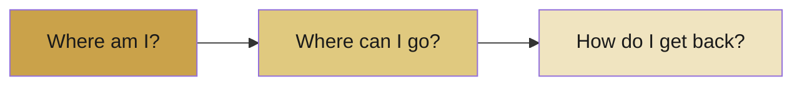
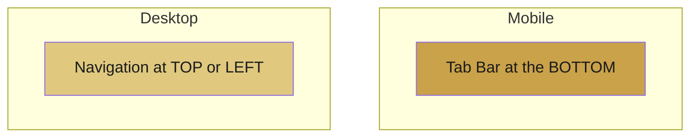
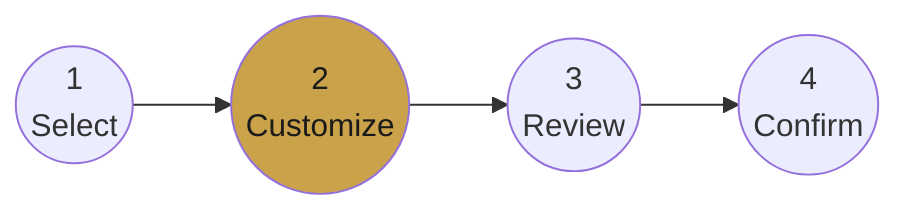

# 📓 Lecture 5 — Navigation

> Navigation is how users move through your app — and how they never get lost.

---

## 🧭 The Three Questions

Good navigation always answers:

If a user can answer all three at any moment, your navigation works.

---

## 🧱 Types of Navigation

| Type | What It Is | Best For |
|------|-----------|----------|
| **Tab Bar** | 4–5 icons at the bottom | Mobile |
| **Hamburger Menu** ☰ | Hidden slide-out menu | Mobile with many options |
| **Top Navigation** | Menu across the top | Desktop |
| **Back Button** | Return to previous screen | Everywhere |
| **Progress Indicator** | Shows position in a process | Forms, checkout |

---

## 📱 Mobile vs Desktop

- **Mobile** → bottom tab bar (easy thumb reach).
- **Desktop** → top or left-side menu (more space).

---

## 📊 Progress Indicators

For multi-step tasks, show users where they are:

This answers **"Where am I?"** and reduces anxiety — the user always knows how much is left.

---

## 🔁 Helping Users Recover

- A clear **Back button** lets users undo a wrong turn.
- **Breadcrumbs** show the path taken.
- Predictable placement (back = top-left, menu = top-right) builds confidence.

---

## ✅ Quick Reference

| Need | Solution |
|------|----------|
| Mobile main nav | Tab Bar |
| Many hidden options | Hamburger Menu |
| Know your position | Progress Indicator |
| Go back safely | Back Button |

---

---
> ✍️ *Writed by Nikan Eidi*

