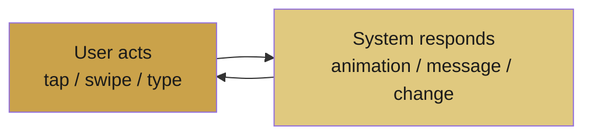
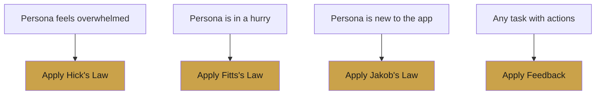

# 📔 Lecture 6 — Interaction Design & UX Laws

> Interaction design is the *conversation* between the user and the system. UX laws make that conversation smooth.

---

## 💬 What Is Interaction Design?

Every interaction is a two-way exchange:

Good interaction = the user always understands what they did and what happened next.

---

## ⚖️ The Core UX Laws

### 1. Hick's Law
> **More choices = slower, harder decisions.**

Reduce options to speed up decisions and prevent overwhelm.
*Example move:* show a few popular options first, hide the rest behind "more."

### 2. Fitts's Law
> **Important buttons should be big and easy to reach.**

Larger, closer targets are faster to tap.
*Example move:* a large primary button at the bottom of a mobile screen.

### 3. Jakob's Law
> **Users expect your app to work like other apps.**

Familiar patterns are learned instantly.
*Example move:* back = top-left, cart = top-right, confirm = bold/primary color.

### 4. Feedback Principle
> **Every action deserves a response.**

Never leave users guessing whether something worked.
*Example move:* a success message after submitting an order.

---

## 🧠 Choosing Laws for a Persona

> Match the law to the persona's pain point — that's how you justify a design decision.

---

## 🔄 Consistency

A design principle that ties everything together:

- Same colors mean the same thing everywhere.
- Buttons behave predictably.
- Layout stays stable across screens.

> Consistency = less to learn = more trust.

---

## 🧰 How to Apply Two Principles (Exam-Style)

For any persona, pick **two laws** and connect each to a **specific UI decision**:

1. **Principle 1** → a concrete UI choice → why it helps.
2. **Principle 2** → a concrete UI choice → why it helps.
3. **Together** → they support the persona because…

> The key is always linking the *law* to a *real UI decision* and back to the *persona*.

---

---
> ✍️ *Writed by Nikan Eidi*

