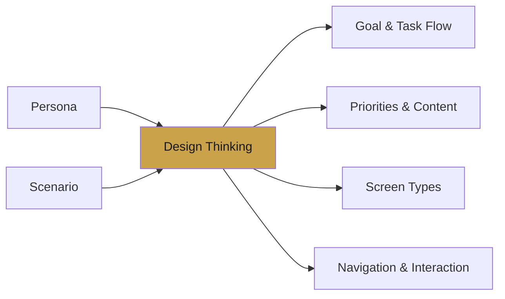
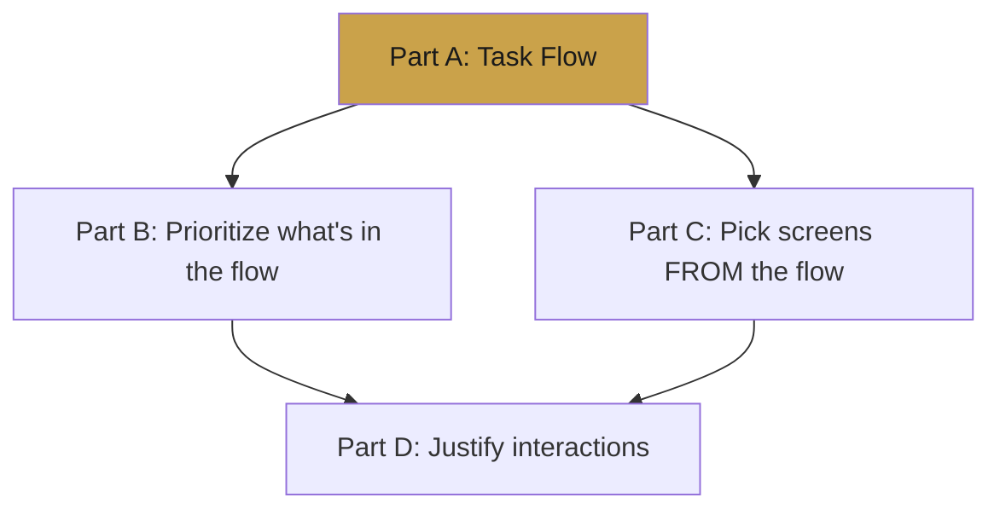

# 📒 Lecture 7 — Putting It Together

> Everything you've learned, combined into one repeatable method: take a **persona + scenario** and produce a complete design answer.

---

## 🎯 The Big Picture

You're always given two inputs — a **persona** (who) and a **scenario** (what) — and you produce four connected outputs.

---

## 🧩 The Four-Part Method

### Part A — User Goal & Task Flow
- Define the user's **main goal** (include the hidden driver).
- List the **needs / pain points**.
- Draw a **task flow** (5–8 steps, no logic branches).
- Note where **feedback** is needed.
- Identify one **friction point** and how design reduces it.

### Part B — Design Priorities & Content
- What **information** matters most before deciding?
- Which **actions** should be easiest to reach?
- Why these fit **this persona**.
- One **design decision** that cuts effort or confusion.

### Part C — Screen Types
Pick three screens and map them:

| Screen | Type | Reason | Key UI Element | User Progress |
|--------|------|--------|----------------|---------------|
| First | Overview | … | … | … |
| Second | Focus | … | … | … |
| Third | Do | … | … | … |

### Part D — Navigation & Interaction
- One **navigation/wayfinding** decision.
- **Two interaction principles**, each tied to a specific UI decision.
- How together they **support the persona**.

---

## 🔗 How the Parts Connect

> Notice: **Part A feeds everything.** Get the task flow right and the rest falls into place.

---

## 🏁 Golden Rules

- **Design for the user, not yourself.**
- **Solve the right problem first**, then solve it right.
- **Every decision needs a reason** — tie it back to the persona.
- **Less is more** — reduce choices and steps.
- **Always close the loop** with feedback.

---

## ✅ Final Checklist

- [ ] Goal includes the *hidden driver*
- [ ] Task flow is 5–8 clean steps
- [ ] Screens mapped to Overview / Focus / Do
- [ ] Two interaction principles linked to real UI choices
- [ ] Every answer connects back to the persona

---

---
> ✍️ *Writed by Nikan Eidi*

